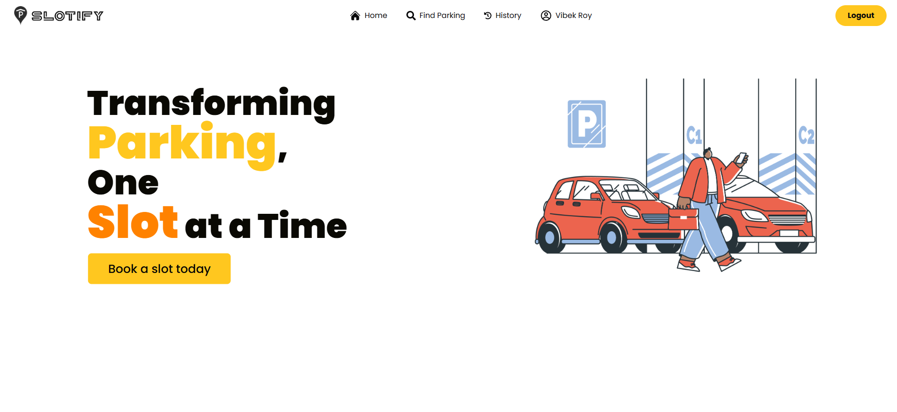
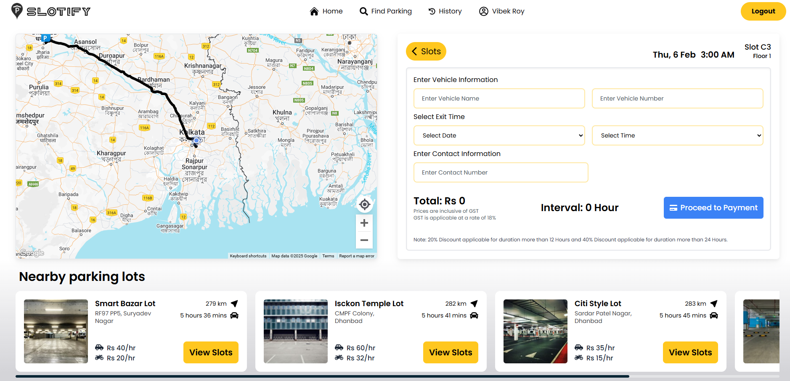

# Slotify - Smart Parking System 🚗

Slotify is a MERN stack-based smart parking system that provides users with a seamless parking experience. It offers real-time slot booking, upfront payment, and slot management while utilizing modern tools like Redis for fast data access.
---

## Demo

You can checkout the project here : https://slotify-j08i.onrender.com/

## Features ✨

- **User Registration & Login:** Secure user authentication.
- **Slot Booking:** Select parking lots from an interactive map and book slots.
- **Upfront Payment:** Make payments for booked slots.
- **Time-Specific Expiration:** Automatic release of slots after expiration.
- **Extend Booking:** Extend slot booking duration with ease.
- **Race Condition Prevention:** Ensure consistent transactions during booking.
- **Fast Access:** Leverages Redis alongside MongoDB for high performance.

---

## Screenshots 🌟

### Home Page


### Login Page


### Slot Booking Page


### Slot Details


## Tech Stack 🛠️

- **Frontend:** React for interactive UI.
- **Backend:** Node.js, Express.js.
- **Database:** MongoDB for persistent storage, Redis for transactions.

---

## Installation & Setup 🚀

1. Clone the repository:
   ```bash
   git clone https://github.com/VibekRoy/Slotify-Smart-Parking-System-.git
   cd Slotify-Smart-Parking-System-
   ```

2. Set up the backend:
   ```bash
   cd backend
   npm install
   ```

3. Set up the frontend:
   ```bash
   cd ../frontend
   npm install
   ```

4. Start the backend:
   ```bash
   cd ../backend
   node server.js
   ```

5. Start the frontend:
   ```bash
   cd ../frontend
   npm run dev
   ```

6. Run Redis (if using Docker):
   ```bash
   docker run --name redis -p 6379:6379 -d redis
   ```

---

## Environment Variables 🛠️

Create a `.env` file in the `backend` directory and include the following variables:

```env
MONGO_URI=your_mongodb_uri
REDIS_HOST=localhost
REDIS_PORT=6379
SOCKET_PORT=your_socket_port
JWT_SECRET=your_secret_key
```

---


## Future Improvements 🚀

- Implementing advanced analytics for parking lot usage.
- Adding support for multiple payment gateways.
- Integration with IoT devices for real-time slot detection.

---

## Contributing 🤝

Contributions are welcome! Feel free to fork the repo and submit pull requests.  

---

## Contact 📬

For any queries, feel free to reach out:  
- **Author:** Vibek Roy  
- **Email:** vibekroy321@gmail.com
- **GitHub:** [VibekRoy](https://github.com/VibekRoy)
